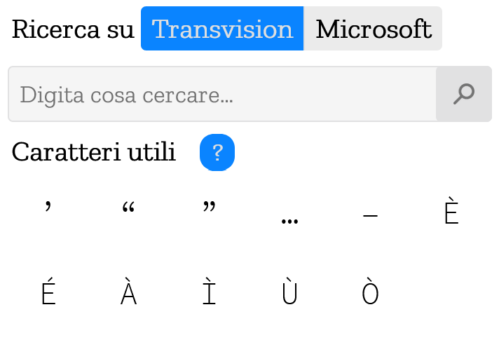

<h1 align="center">
     
    
     
    Mozilla Italia l10n addon
     
</h1>
Repo ufficiale di https://addons.mozilla.org/it/firefox/addon/mozita-l10n/.

  

 

Per supportare il mio lavoro, puoi effettuare una donazione :smile: con **PayPal**, **LiberaPay** o **Ko-Fi**:

 [</img>](https://paypal.me/pools/c/8yl6auiU6e) [</img>](https://ko-fi.com/R5R31UQ8G)

Questa estensione Firefox è stata pensata e realizzata per necessità del team L10n di Mozilla Italia; infatti, permette di copiare con un singolo clic uno dei caratteri presenti nella finestra popup (sono i caratteri maggiormente utilizzati dal team e che non sono presenti sulle tastiere comuni) oppure effettuare una veloce ricerca su Transvision, su Microsoft Language Portal o su Pontoon.

Puoi anche aprire velocemente l’estensione con la scorciatoia da tastiera `Ctrl+Alt+I`

È possibile scaricarla gratuitamente dal sito ufficiale di Firefox Addons: https://addons.mozilla.org/it/firefox/addon/mozita-l10n/.

## Come contribuire
Per contribuire è sufficiente aprire un _Issue_ nelle sezione apposita. Segnalazioni di bug, oppure di eventuali nuove funzioni sono assolutamente ben accette.

## Screenshot

## License

