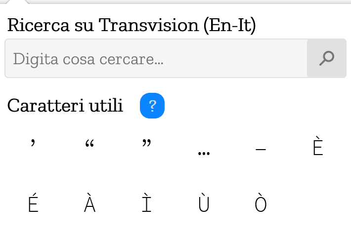

# Mozilla Italia L10n (MozIta L10n Addons)
Questa estensione Firefox è stata pensata e realizzata per necessità del team L10n di Mozilla Italia; infatti, permette di copiare con un singolo clic uno dei caratteri presenti nella finestra popup (sono i caratteri maggiormente utilizzati dal team e che non sono presenti sulle tastiere comuni) oppure effettuare una veloce ricerca su Transvision.
È possibile scaricarla gratuitamente dal sito ufficiale di Firefox Addons: https://addons.mozilla.org/it/firefox/addon/mozita-l10n-addons/.

## Come contribuire
Per contribuire è sufficiente aprire un _Issue_ nelle sezione apposita. Segnalazioni di bug, oppure di eventuali nuove funzioni sono assolutamente ben accette.

## Screenshot

